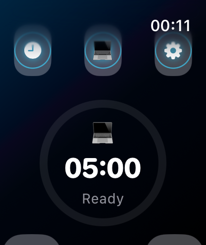
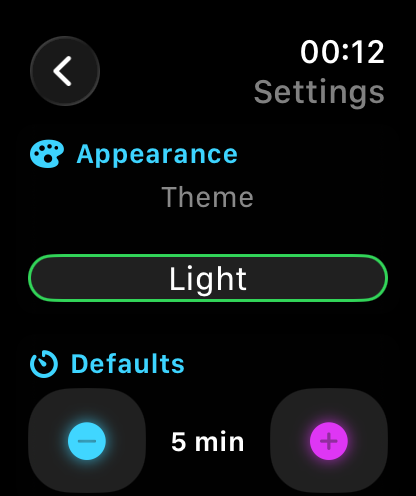
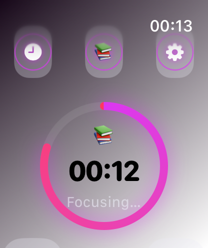
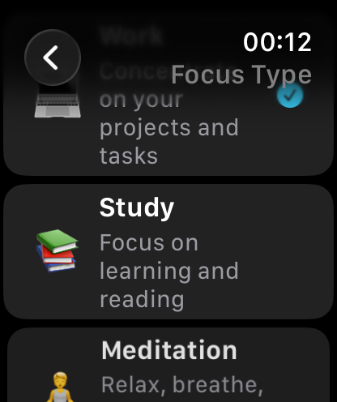
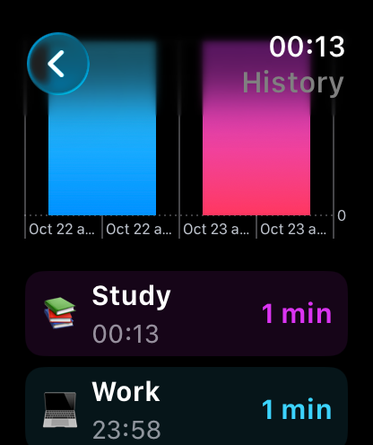
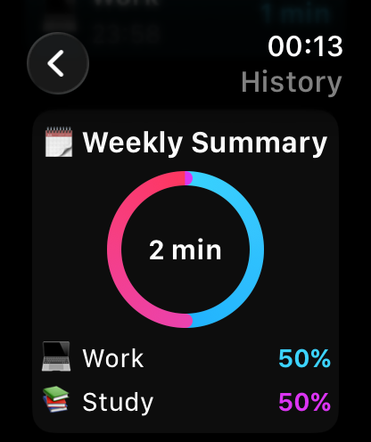

# ⏱ FocusTimerPlus — Smart Focus Timer for Apple Watch  

Stay productive and mindful with **FocusTimerPlus**, a beautifully designed focus timer built for Apple Watch.  
Choose your focus category, track achievements, and visualize your weekly progress — all from your wrist.

---

## 🏠 Main Screen  



Focus view with circular progress ring, glowing category accent, and one-tap Start/Pause control.  
Easily adjust session length with Digital Crown or +/− buttons.

---

## ⚙️ Settings Screen  

 (

Customize your default session duration, theme (Dark / Light / System), and haptic feedback preferences.

---

## 🧘 Focus Categories  



Choose your focus mode:
- 💻 **Work** — Boost productivity  
- 📚 **Study** — Stay focused during learning  
- 🧘 **Meditation** — Mindful relaxation sessions  

Each category changes the **timer ring color** and app accent dynamically.

---

## 📊 History & Weekly Trends  




All completed sessions are stored and displayed with colored bars representing different focus types.  
Track your total minutes and weekly productivity trends.

---

## 🧩 Tech Stack  
- **SwiftUI** for native watchOS interface  
- **Combine** for reactive timer state  
- **Charts Framework** for history visualization  
- **WidgetKit** for complications and data refresh  
- **UserDefaults + Codable** for local persistence  

---

## 🚀 Getting Started  

1. Clone the repository  
   ```bash
   git clone [(https://github.com/rabbitrunout/iOSApp3)]
